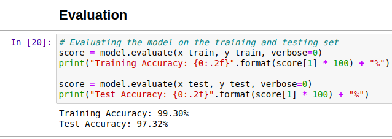

# Binary-classification-of-audio
Binary classification of audio based on gunshot audio

This project was done for coding interview. Below are the details in brief:
1. Build an tensorflow model that can identify high peak in an audio or a video data that is caused by a surge, example gunshot accident scream etc
2. Build a flask api where the API can receive the video url or audio url to be passed as an argument
3. The program should be able to provide the output via response or stored locally as a file
4. Also Dockerize the model such that the API is exposed to the port number 0.0.0.0:8080 or localhost:5000 as per the arguments passed.

UrbanSound8K dataset was used for this task. This dataset contains 8732 labeled sound excerpts (<=4s) of urban sounds from 10 classes: air_conditioner, car_horn, children_playing, dog_bark, drilling, enginge_idling, gun_shot, jackhammer, siren, and street_music.
In the dataset, metadata file(```UrbanSound8k.csv```) which has information of audio file location, class, etc., was modified for binary classification by just changing Class ID and Class Name
Librosa library is used to extract MFCC features and then CNN model was trained, check ```app.py``` for feature extraction and model. Code is pretty straight forward.

Here's training and validation accuracy of model


## Use:
The project can simply run in Python version: 3.7.6 by following steps 
1. Install necessary libraries by simply running:
```pip install -r requirments.txt```
2. Run flask app by:
```python app.py```
3. Install and open Advanced Rest Client and choose options accordingly as shown below, choose any short .wav file to test


#### Tip: Gunshot audio can be downloaded to test from here: http://soundbible.com/2120-9mm-Gunshot.html


Docker Image is available here: https://drive.google.com/file/d/17xlKG7q9TYxGRUM4WPpHWg3QGrqGS_HO/view?usp=sharing

Load Docker Image by 
```docker load --input bca_intelense.tar```

and run by 
```sudo docker run -p 5000:5000 my_docker_flask:latest```

and then use ARC for testing as shown above.


